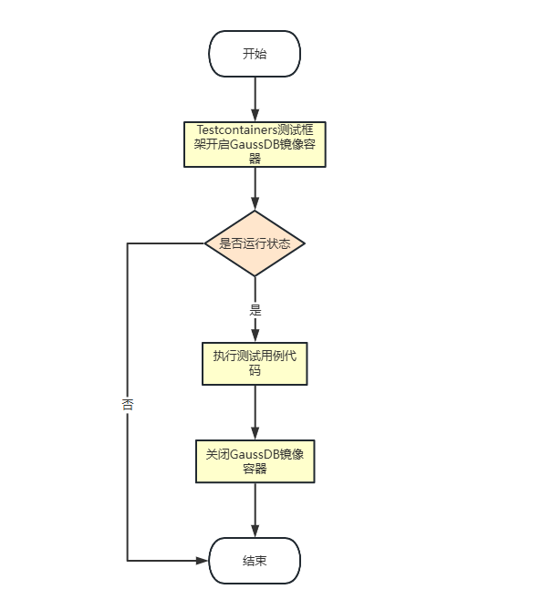

[中文版](README_zh.md)

# Using Testcontainers for Flink Integration with GaussDB Testing

## Introduction
Testcontainers is a very useful tool that helps us easily create and manage various containerized services in the test environment. Currently, Flink supports many database connectors, such as the MySQL connector (flink-connector-jdbc-mysql), the PostgreSQL connector (flink-connector-jdbc-postgre), etc. Mainstream database vendors like PostgreSQL, Oracle, and MySQL have already implemented testing within the Testcontainers testing framework, but GaussDB has not. When providing a database connector for GaussDB (flink-connector-jdbc-gaussdb) to Flink, we need to synchronously implement testing for GaussDB using the Testcontainers testing framework according to community specifications. Only in this way can the GaussDB database connector (flink-connector-jdbc-gaussdb) be successfully merged into the open-source community.

## I. Introduction to Testcontainers
Testcontainers is an open-source library that provides disposable, lightweight instances of databases, message brokers, web browsers, or almost anything that can run in a Docker container. There's no need for mocking or complex environment configuration. Define test dependencies as code, create containers, simply run tests, and finally clean up the containers. Testcontainers supports multiple languages and testing frameworks and only requires Docker to be installed.

## II. Implementing Support for GaussDB Testing with Testcontainers

1. **Preparation**: Docker needs to be installed. The installation tutorial can be found at: [Learn to Install and Use Docker in 10 Minutes](https://blog.csdn.net/baidu_36511315/article/details/108117826)
2. **Adding Dependencies**: First, add the relevant dependencies for Testcontainers and GaussDB to our project. If it's a Maven project, add the following dependencies to the `pom.xml` file:
```xml
<dependency>
    <groupId>org.testcontainers</groupId>
    <artifactId>testcontainers</artifactId>
    <version>1.21.0</version>
</dependency>
<dependency>
    <groupId>com.huaweicloud.gaussdb</groupId>
    <artifactId>gaussdbjdbc</artifactId>
    <version>506.0.0.b058</version>
</dependency>
```
3. **Creating the GaussDBContainer Class**:
```
1. Refer to the structure of PostgreSQLContainer and define the GaussDBContainer class, which inherits from GenericContainer.
2. Set the Docker image name, exposed ports, waiting strategy, username, password, etc. of GaussDB according to requirements.
3. Provide methods to obtain the JDBC URL, username, and password.
```
Code address: [GaussDBContainer](https://github.com/tsohnugo/testcontainers-java/blob/main/modules/gaussdb/src/main/java/org/testcontainers/containers/GaussDBContainer.java)

## III. Using the Created GaussDBContainer for Flink Testing

### 3.1 **Testing Process**


### 3.2 **Writing Flink Test Code**

#### 3.2.1 The `GaussdbDatabase` Class
A GaussDB database instance for testing is created based on a Docker container, which includes parameters for testing database connections. The running status of the database container is checked when obtaining the instance. The code is as follows:
```java
package org.apache.flink.connector.jdbc.gaussdb.testutils;

import org.apache.flink.connector.jdbc.testutils.DatabaseExtension;
import org.apache.flink.connector.jdbc.testutils.DatabaseMetadata;
import org.apache.flink.connector.jdbc.testutils.DatabaseResource;
import org.apache.flink.connector.jdbc.testutils.resources.DockerResource;
import org.apache.flink.util.FlinkRuntimeException;

import org.testcontainers.utility.DockerImageName;

import static org.apache.flink.util.Preconditions.checkArgument;

/**
 * A Gaussdb database for testing.
 *
 * <p>Notes: The source code is based on PostgresDatabase.
 */
public class GaussdbDatabase extends DatabaseExtension implements GaussdbImages {

    private static final GaussDBContainer<?> CONTAINER =
            new GaussdbXaContainer(IMAGE).withMaxConnections(10).withMaxTransactions(50);

    private static GaussdbMetadata metadata;

    public static GaussdbMetadata getMetadata() {
        if (!CONTAINER.isRunning()) {
            throw new FlinkRuntimeException("Container is stopped.");
        }
        if (metadata == null) {
            metadata = new GaussdbMetadata(CONTAINER, true);
        }
        return metadata;
    }

    protected DatabaseMetadata getMetadataDB() {
        return getMetadata();
    }

    @Override
    protected DatabaseResource getResource() {
        return new DockerResource(CONTAINER);
    }

    /** {@link GaussDBContainer} with XA enabled (by setting max_prepared_transactions). */
    public static class GaussdbXaContainer extends GaussDBContainer<GaussdbXaContainer> {
        private static final int SUPERUSER_RESERVED_CONNECTIONS = 1;
        private int maxConnections = SUPERUSER_RESERVED_CONNECTIONS + 1;
        private int maxTransactions = 1;

        public GaussdbXaContainer(String dockerImageName) {
            super(DockerImageName.parse(dockerImageName));
        }

        public GaussdbXaContainer withMaxConnections(int maxConnections) {
            checkArgument(
                    maxConnections > SUPERUSER_RESERVED_CONNECTIONS,
                    "maxConnections should be greater than superuser_reserved_connections");
            this.maxConnections = maxConnections;
            return this.self();
        }

        public GaussdbXaContainer withMaxTransactions(int maxTransactions) {
            checkArgument(maxTransactions > 1, "maxTransactions should be greater 1");
            this.maxTransactions = maxTransactions;
            return this.self();
        }

        @Override
        public void start() {
            super.start();
        }
    }
}
```

#### 3.2.2 The `GaussdbFinkTest` Class
This class mainly sets up the test environment, initializes a series of configurations and resources for testing, and creates the necessary resources for testing. It takes creating a database and verifying its existence as an example. The code is as follows:
```java
package org.apache.flink.connector.jdbc.gaussdb.database.catalog;

import org.apache.flink.connector.jdbc.gaussdb.GaussdbTestBase;
import org.apache.flink.connector.jdbc.gaussdb.testutils.GaussdbDatabase;
import org.apache.flink.connector.jdbc.testutils.DatabaseMetadata;
import org.apache.flink.connector.jdbc.testutils.JdbcITCaseBase;
import org.junit.jupiter.api.BeforeAll;
import org.junit.jupiter.api.Test;

import java.sql.Connection;
import java.sql.DriverManager;
import java.sql.SQLException;
import java.sql.Statement;

import static org.assertj.core.api.Assertions.assertThat;

class GaussdbFlinkTest implements JdbcITCaseBase, GaussdbTestBase {

    private static DatabaseMetadata getStaticMetadata() {
        return GaussdbDatabase.getMetadata();
    }

    protected static GaussdbCatalog catalog;
    protected static final String TEST_CATALOG_NAME = "mypg";
    protected static final String TEST_DB = "test";
    protected static final String TEST_SCHEMA = "test_schema";
    protected static String baseUrl;
    protected static final String TEST_USERNAME = getStaticMetadata().getUsername();
    protected static final String TEST_PWD = getStaticMetadata().getPassword();

    @BeforeAll
    static void init() throws SQLException {
        // jdbc:postgresql://localhost:50807/gaussdb?user=gaussdb
        String jdbcUrl = getStaticMetadata().getJdbcUrl();
        // jdbc:postgresql://localhost:50807/
        baseUrl = jdbcUrl.substring(0, jdbcUrl.lastIndexOf("/"));
        catalog =
                new GaussdbCatalog(
                        Thread.currentThread().getContextClassLoader(),
                        TEST_CATALOG_NAME,
                        GaussdbCatalog.DEFAULT_DATABASE,
                        TEST_USERNAME,
                        TEST_PWD,
                        baseUrl);
        // create test database and schema
        createSchema(TEST_DB, TEST_SCHEMA);
    }

    public static void executeSQL(String db, String sql) throws SQLException {
        try (Connection conn =
                     DriverManager.getConnection(
                             String.format("%s/%s", baseUrl, db), 
                             TEST_USERNAME, TEST_PWD);
             Statement statement = conn.createStatement()) {
                statement.executeUpdate(sql);
        } catch (SQLException e) {
            throw e;
        }
    }

    public static void createSchema(String db, String schema) throws SQLException {
        executeSQL(db, String.format("CREATE SCHEMA %s", schema));
    }

    @Test
    void testDbExists() {
        assertThat(catalog.databaseExists("nonexistent")).isFalse();

        assertThat(catalog.databaseExists(GaussdbCatalog.DEFAULT_DATABASE))
        .isTrue();
    }

}
```
Source code address of flink-connector-jdbc-gaussdb: [flink-connector-jdbc-gaussdb](https://github.com/Tyhoning/flink-connector-jdbc/tree/main/flink-connector-jdbc-gaussdb)

## IV. Summary
By using the Testcontainers tool, we can more conveniently set up the test environment, improving the efficiency and reliability of testing. This method can be used not only for local testing but also in the continuous integration and continuous delivery (CI/CD) process to ensure the stability and correctness of our Flink applications when interacting with GaussDB. It is hoped that this article will be helpful to everyone in using the Testcontainers tool for Flink and GaussDB-related development and testing.

Some configuration information in the above code (such as Docker image name, username, password, etc.) needs to be adjusted according to the actual situation.
